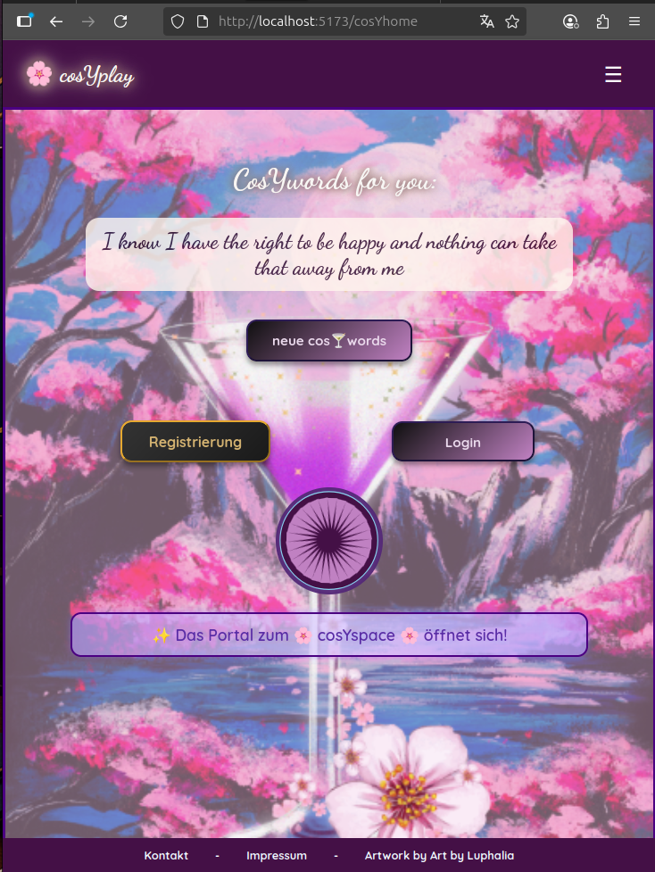
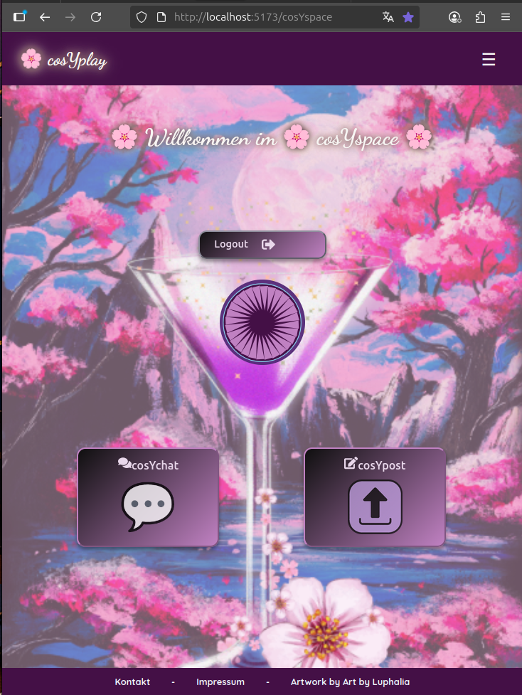
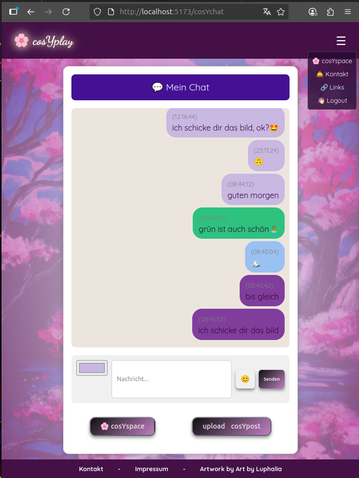
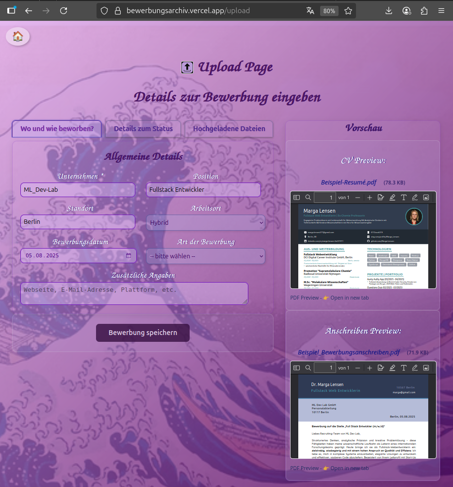
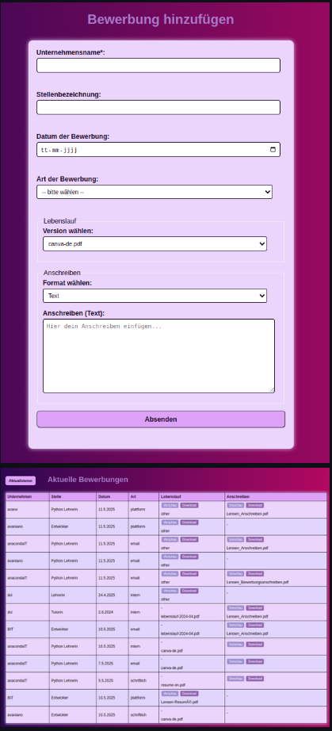
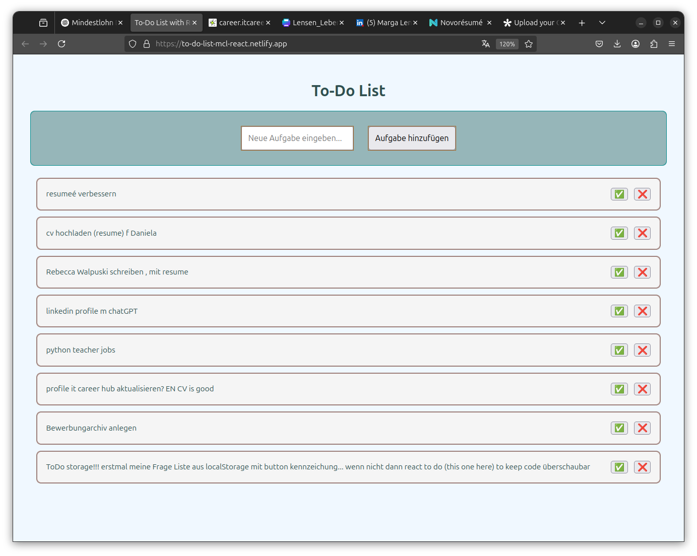

← <a href="./README.md">Back to main README</a>

---

### 🪄 A glimpse into the Digital Alchemist's Lab; see what's brewing ✨

---

### 🆕 **cosYplay 🌸**
#### Fullstack monolithic SPA with micro-apps

**GitHub:** [cosYspace-auth](https://github.com/Marga-Lensen/cosYspace-auth) | [cosYplay-frontend](https://github.com/Marga-Lensen/cosYplay-frontend) | [cosYplay-backend](https://github.com/Marga-Lensen/cosYplay-backend)

**Live:** [cosYplay (vercel.app)](https://cos-yplay-frontend.vercel.app)  
<!-- **Backend:** Backend ready – waiting for deployment   -->
**Links:** [https://wonderl.ink/@cosyplay](https://wonderl.ink/@cosyplay)

---

2 Landing pages - public cosYhome & private cosYspace

 

<table>
  <thead>
    <tr>
        <th> cos🍸️home</th>
        <th>🌸 cosYspace 🌸</th>
    </tr>
  </thead>
  <tbody>
    <tr>
<td>
  
</td>
    <td>
      
        </td>
    </tr>
  </tbody>
</table>

2 social apps - cosYchat & cosYpost

 

<table>
  <thead>
    <tr>
      <th>💬 cosYchat</th>
      <th>🌄 cosYpost</th>
    </tr>
  </thead>
  <tbody>
    <tr>
      <td>
        
      </td>
      <td>
        
        </td>
    </tr>
  </tbody>
</table>

<!-- <strong>Links:</strong>  -->
<!-- <a href="https://wonderl.ink/@cosyplay">https://wonderl.ink/@cosyplay</a> -->

<a href="#top">↑ Back to top</a>

---

## 🧩 **Full Stack Projects**

These projects include both **frontend** & **backend** logic; involving authentication, routing, APIs, and databases.

### 🔐 **Authentication Backends**

These projects were built with the <em>"backend‑first"</em> approach, and the frontend UI was adapted to offer the functionality to the user

 

<table>
  <thead>
    <tr>
      <th>👤 UserApp</th>
      <th>🛡️ Aunty Authy App</th>
    </tr>
  </thead>
  <tbody>
    <tr>
      <td>
        <strong>GitHub:</strong> <a href="https://github.com/Marga-Lensen/auth-repo20-backend">auth-repo20-backend</a> 
        <strong>Live:</strong> Deployment coming soon 
        <strong>Backend:</strong> Backend ready – waiting for deployment 
        
      </td>
      <td>
        <strong>GitHub:</strong> <a href="https://github.com/Marga-Lensen/Aunty-Authy-App">Aunty-Authy-App</a> 
        <strong>Live:</strong> Deployment coming soon 
        <strong>Backend:</strong> Backend ready – waiting for deployment 
        
      </td>
    </tr>
  </tbody>
</table>

<a href="#top">↑ Back to top</a>

---

### 🗃️ **File Upload Systems**

📂 BewerbungsArchiv – File Upload System (<em>Backend‑first</em>)

 

<table>
  <thead>
    <tr>
      <th>BewerbungsArchiv (elaborated version)</th>
      <th>BewerbungsArchiv (basic version)</th>
    </tr>
  </thead>
  <tbody>
    <tr>
      <td>
        <strong>GitHub:</strong> <a href="https://github.com/Marga-Lensen/Bewerbungsarchiv">Bewerbungsarchiv</a> 
        <strong>Live:</strong> <a href="https://bewerbungsarchiv.vercel.app/upload">Bewerbungsarchiv.vercel.app</a> 
        <strong>Backend:</strong> Backend ready – waiting for deployment
         
      </td>
      <td>
        <strong>GitHub:</strong> <a href="https://github.com/Marga-Lensen/BewerbungsMgmt-fileUpload?tab=readme-ov-file">BewerbungsArchiv fileUpload</a> 
        <!-- <strong>Live:</strong> Deployment coming soon 
        <strong>Backend:</strong> Backend ready – waiting for deployment -->
         
      </td>
    </tr>
  </tbody>
</table>

<a href="#top">↑ Back to top</a>

---

<h3>😃 <strong>Web Apps for  Entertainment & Wellbeing 🍀</strong></h3>

 Video Searching and Streaming App "MeTube"  & Serenity Prayer in Zen style 

 

<table>
  <thead>
    <tr>
      <th>▶️ MeTube</th>
      <th>🧘 Serenity Zen</th>
    </tr>
  </thead>
  <tbody>
    <tr>
      <td>
        <strong>GitHub:</strong> <a href="https://github.com/Marga-Lensen/YouTubing-App">YouTubing-App</a> 
        <strong>Live:</strong> <a href="https://you-tubing-app.vercel.app">you-tubing-app.vercel.app</a> 
<!--         <strong>Backend:</strong> Not applicable 
 -->        
      </td>
      <td>
        <strong>GitHub:</strong> <a href="https://github.com/Marga-Lensen/Serenity-zen">Serenity-zen</a> 
        <strong>Live:</strong> <a href="https://serenity-zen.vercel.app">serenity-zen.vercel.app</a> 
<!--         <strong>Backend:</strong> Not applicable 
 -->        
      </td>
    </tr>
  </tbody>
</table>

<a href="#top">↑ Back to top</a>

---

<h3>✅ <strong>Data Management Tool</strong></h3>

ToDo Projects - two Examples

 

<table>
  <thead>
    <tr>
      <th>🧠 ToDo‑ABCD‑TaDaaaa</th>
      <th>🧠 ToDo React</th>
    </tr>
  </thead>
  <tbody>
    <tr>
      <td><!-- <em>todoABCDtada placeholder</em> -->
      </td>
      <td><!-- <em>todo schlicht placeholder</em> -->
      </td>
    </tr>
  </tbody>
</table>

<a href="#top">↑ Back to top</a>

---

<h2>🎨 <strong>Frontend Projects</strong></h2>

<h3>🧠 With TypeScript</h3>

Gymnasien Vergleich / QuestionsQuiz

 

<table>
  <thead>
    <tr>
      <th>🏫 Gymnasien Vergleich</th>
      <th>❓ QuestionsQuiz</th>
    </tr>
  </thead>
  <tbody>
    <tr>
      <td><!-- <em>Gymnasien placeholder</em> -->
      <strong>GitHub:</strong> <a href="https://github.com/Marga-Lensen/GymnasienVergleich">GymnasienVergleich</a> 
        <strong>Live:</strong> <a href="https://gymnasien">gymnasien-vergleich.vercel.app</a> 
        <strong>Backend:</strong> no database; local JSON data 
        
      </td>
      <td>
        <strong>GitHub:</strong> <a href="https://github.com/Marga-Lensen/QuestionsQuiz">QuestionsQuiz</a> 
        <strong>Live:</strong> <a href="https://questions-api-j59e.vercel.app">questions-api-j59e.vercel.app</a> 
        <strong>Backend:</strong> Backend ready – waiting for deployment 
        
      </td>
    </tr>
  </tbody>
</table>

<a href="#top">↑ Back to top</a>

<!-- <h4>🧾 Backend Cheat Sheet</h4>
 -->

Backend Cheat Sheet

 

<strong>GitHub:</strong> <a href="https://github.com/Marga-Lensen/BackendCheatSheet">BackendCheatSheet</a> 
<strong>Live:</strong> <a href="https://backend-cheat-sheet.vercel.app">backend-cheat-sheet.vercel.app</a> 
<!-- <strong>Backend:</strong> Not applicable

 -->

<a href="#top">↑ Back to top</a>

---

<h2>🧪 <strong>Educational / Experimental</strong></h2>

<h3>🧠 Marga's Tutoring</h3>

<em>Besonderes Projekt für die ganze Breite – placeholder, ergänzen.</em>

---

<h3>🐍 With Python</h3>

Python Temperature Tracker

 

<table>
  <tbody>
    <tr>
      <td>
        <strong>GitHub:</strong> <a href="https://github.com/Marga-Lensen/Python_TemperatureDaily">Python_TemperatureDaily</a> 
        <strong>Live:</strong> <a href="https://python-temperature-daily.vercel.app">python-temperature-daily.vercel.app</a> 
        <strong>Backend:</strong>Not needed - Data fetched from (open) API's 
        
      </td>
    </tr>
  </tbody>
</table>

<a href="#top">↑ Back to top</a>

---

<h3>⭐ API Experiments</h3>

SWAPI Viewer

 

<table>
  <tbody>
    <tr>
      <td>
        <strong>GitHub:</strong> <a href="https://github.com/Marga-Lensen/SWAPI">SWAPI</a> 
        <strong>Live:</strong> <a href="https://swapi-fawn-eight.vercel.app">swapi-fawn-eight.vercel.app</a> 
        <strong>Backend:</strong>Not needed - data from Star Wars API 
        
      </td>
    </tr>
  </tbody>
</table>

<a href="#top">↑ Back to top</a>

---

<h2>🧰 <strong>Tools, Generators, Scripts, Gists</strong></h2>
<ul>
  <li>README Generator</li>
  <li>Portfolio Generator</li>
  <li>Chat Archives</li>
  <li>Backend Generator Scripts</li>
  <li>and more...
    
  </li>
</ul>

<strong>for more Info: see this <a href="https://gist.github.com/Marga-Lensen/34ba12f0d9d572b92d55cc518474940b" target="_blank">
     Gist
    </a></strong>

← <a href="./README.md">Back to main README</a>

---

<footer>
  

    <h3><strong>Motto of a Digital Alchemist</strong></h3><!--   -->
    <h4 style="color: goldenrod; font-weight: bold;">Turning Code into Gold 🪄</h4><!--   -->
    
  

</footer>
