

← <a href="./README.md">Back to main README</a>

---

## 🏫 **GymnasienVergleich**
- **GitHub:** [Gymnasien-Feb2025](https://github.com/Marga-Lensen/Gymnasien-Feb2025)  
- **Live:** [gymnasien-vergleich.vercel.app](https://gymnasien-vergleich.vercel.app)  
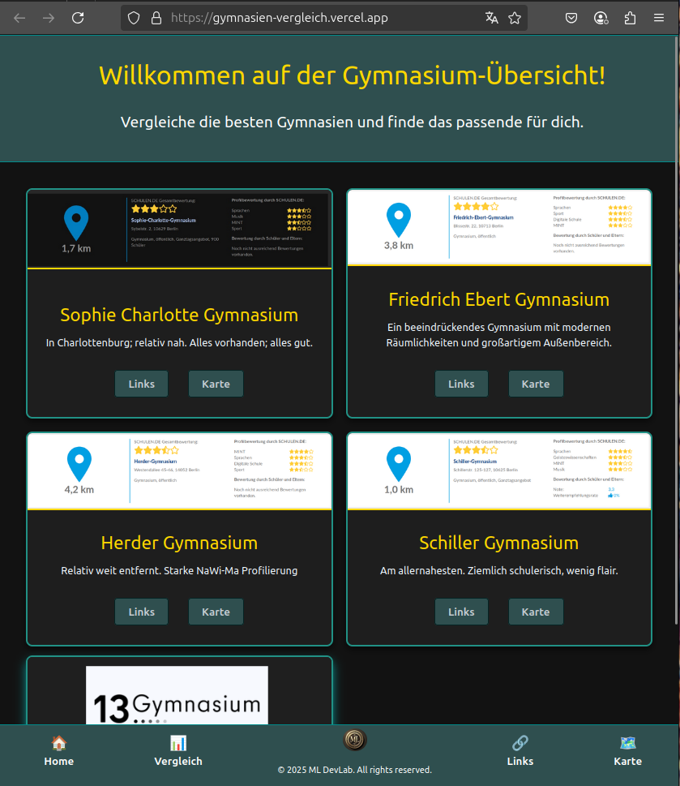

<a href="#top">↑ Back to top</a>

---

## 🌡️ **./Python_TemperatureDaily**
- **GitHub:** [Python_TemperatureDaily](https://github.com/Marga-Lensen/Python_TemperatureDaily)  
- **Live:** [python-temperature-daily.vercel.app](https://python-temperature-daily.vercel.app)  
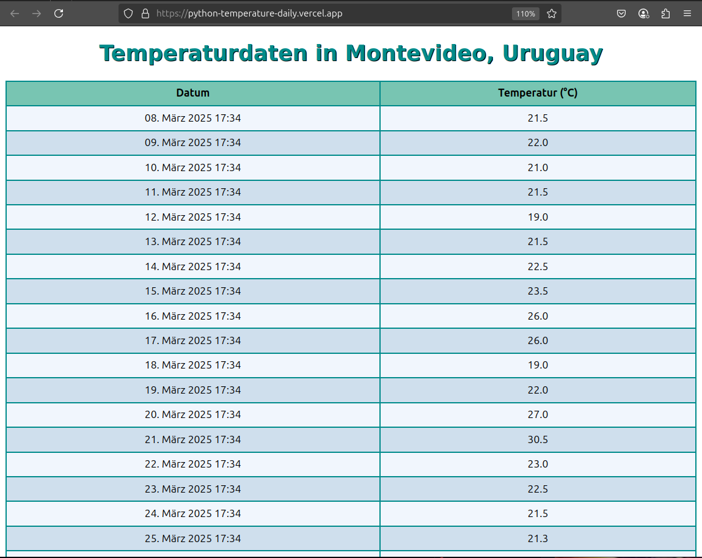

<a href="#top">↑ Back to top</a>

---

## ❓ **Questions-Quiz**
- **GitHub:** [QuestionsQuiz](https://github.com/Marga-Lensen/QuestionsQuiz)  
- **Live:** [questions-api-j59e.vercel.app](https://questions-api-j59e.vercel.app)  
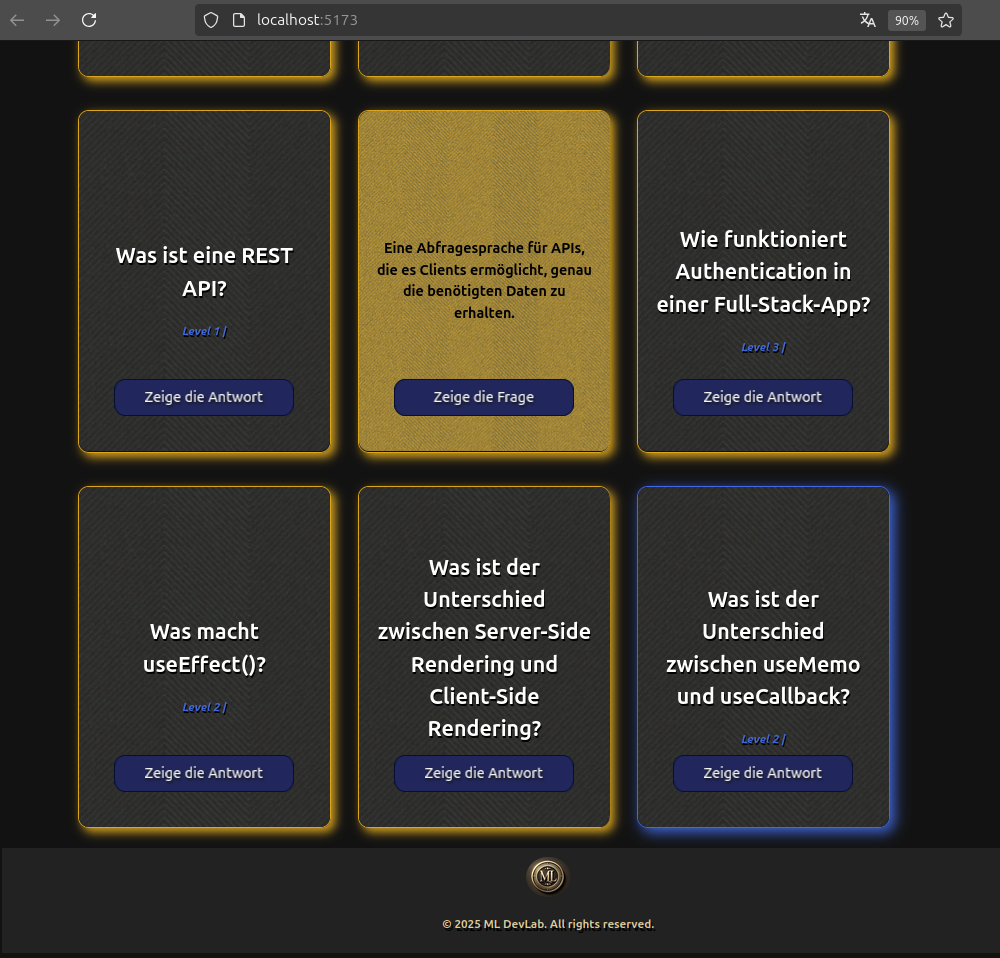

<a href="#top">↑ Back to top</a>

---

## 🕊️ **./Serenity-prayer-Dutch**
- **GitHub:** [Serenity-prayer-Dutch](https://github.com/Marga-Lensen/Serenity-prayer-Dutch)  
- **Live:** [serenity-prayer-dutch.vercel.app](https://serenity-prayer-dutch.vercel.app)  
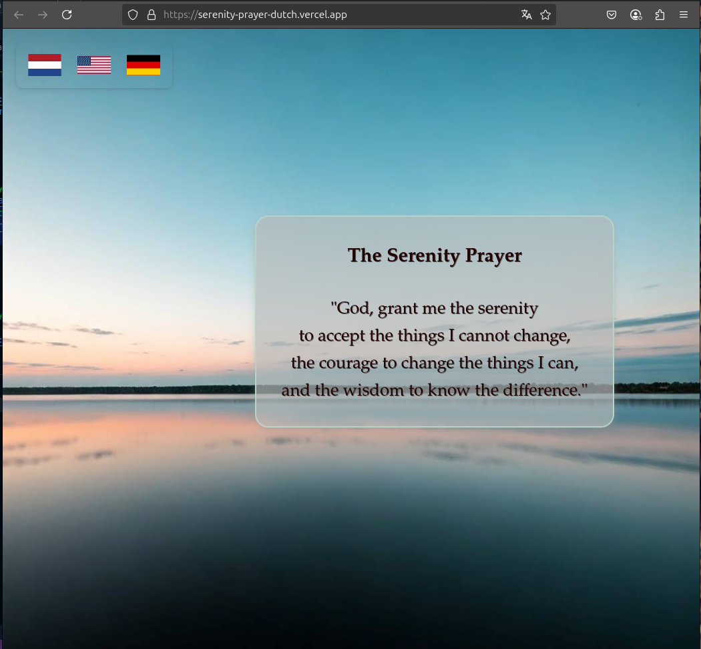

<a href="#top">↑ Back to top</a>

---

## 🧘 **./Serenity-zen**
- **GitHub:** [Serenity-zen](https://github.com/Marga-Lensen/Serenity-zen)  
- **Live:** [serenity-zen.vercel.app](https://serenity-zen.vercel.app)  
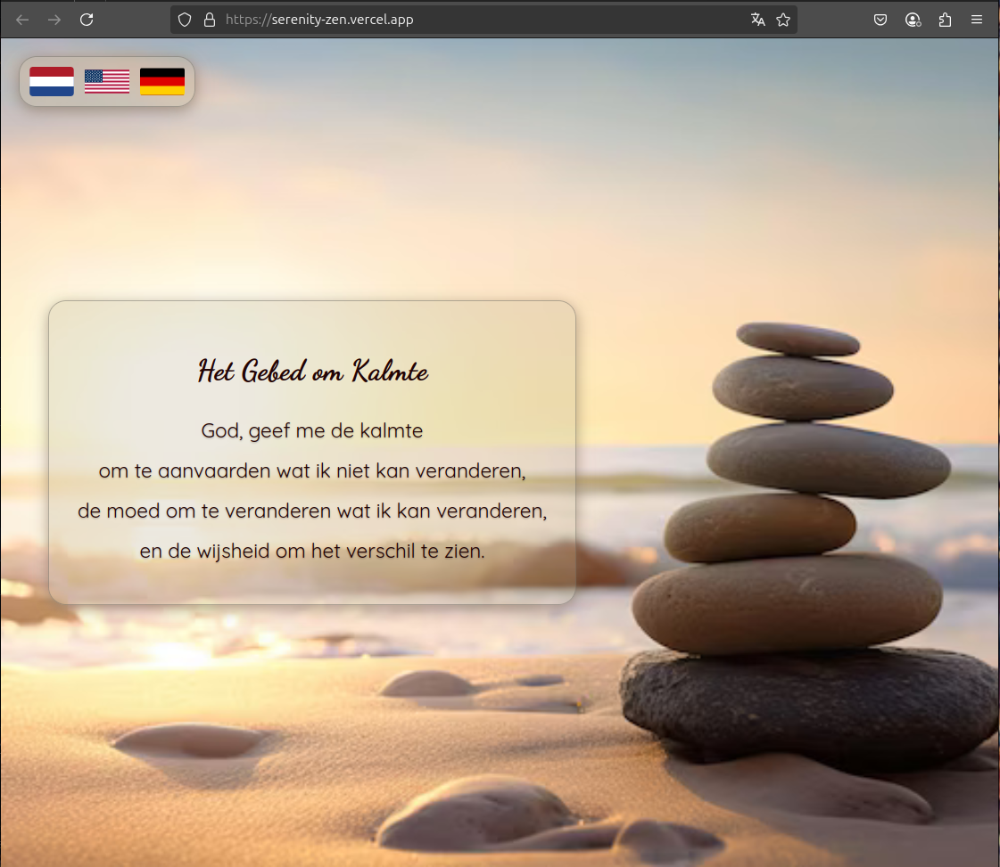

<a href="#top">↑ Back to top</a>

---

## ⭐ **./SWAPI**
- **GitHub:** [SWAPI](https://github.com/Marga-Lensen/SWAPI)  
- **Live:** [swapi-fawn-eight.vercel.app](https://swapi-fawn-eight.vercel.app)  
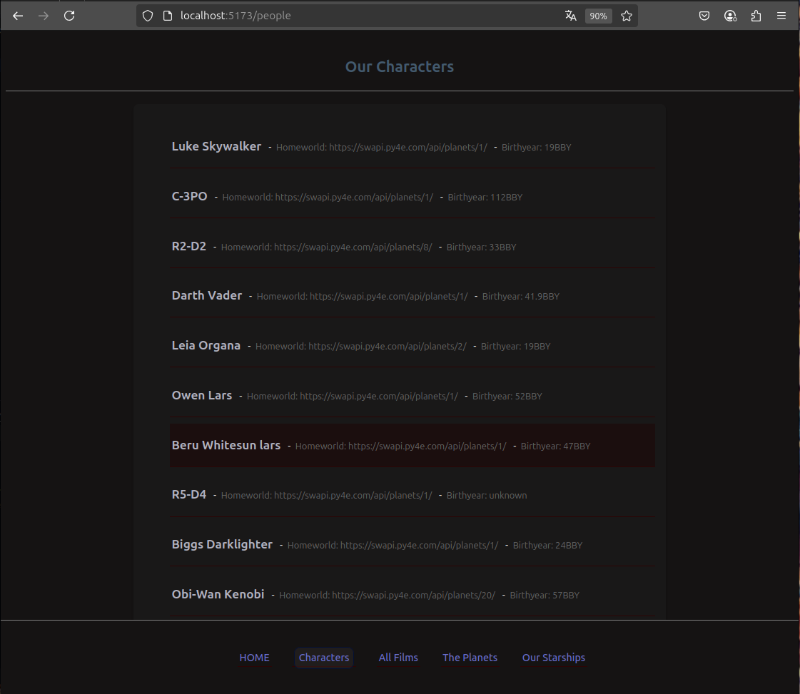

<a href="#top">↑ Back to top</a>

---

## 👤 **UserApp**
- **GitHub:** [auth-repo20-backend](https://github.com/Marga-Lensen/auth-repo20-backend)  
- **Live:** _Deployment link coming soon_  
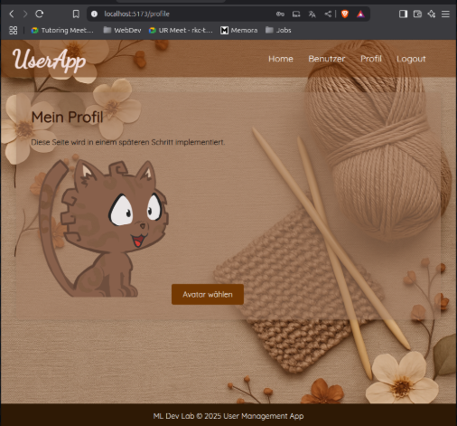

<a href="#top">↑ Back to top</a>

---

## 🤝 **Collaboration Project Backend**
- **GitHub:** [backend-collab-project](https://github.com/Marga-Lensen/backend-collab-project)  
- **Live:** _Deployment link coming soon_  
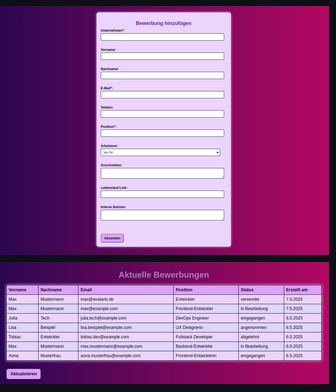

<a href="#top">↑ Back to top</a>

---
## 🆙 **BewerbungsMgmt-fileUpload**
- **GitHub:** [backend-collab-project](https://github.com/Marga-Lensen/BewerbungsMgmt-fileUpload?tab=readme-ov-file)  
- **Live:** _Deployment link coming soon_  
)

<a href="#top">↑ Back to top</a>

---

## 📺 **MeTube**
- **GitHub:** [YouTubing-App](https://github.com/Marga-Lensen/YouTubing-App)  
- **Live:** [you-tubing-app.vercel.app](https://you-tubing-app.vercel.app)  
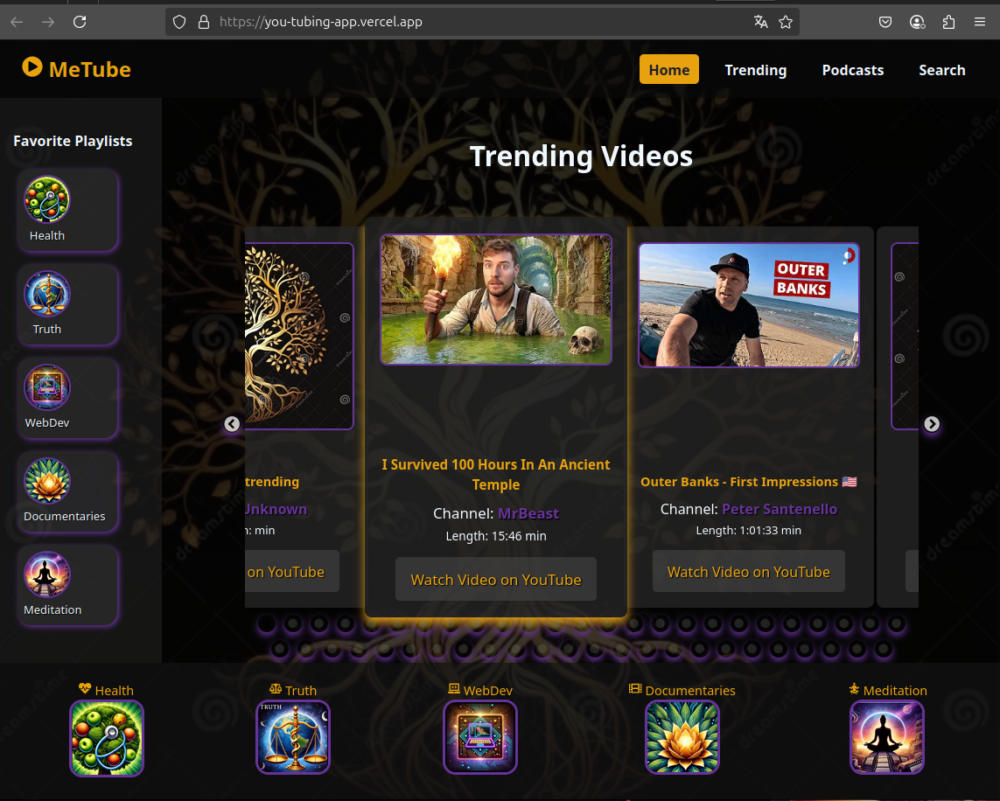

<a href="#top">↑ Back to top</a>

---

## 🛡️ **./Aunty-Authy-App**
- **GitHub:** [Aunty-Authy-App](https://github.com/Marga-Lensen/Aunty-Authy-App)  
- **Live:** _Deployment link coming soon_  
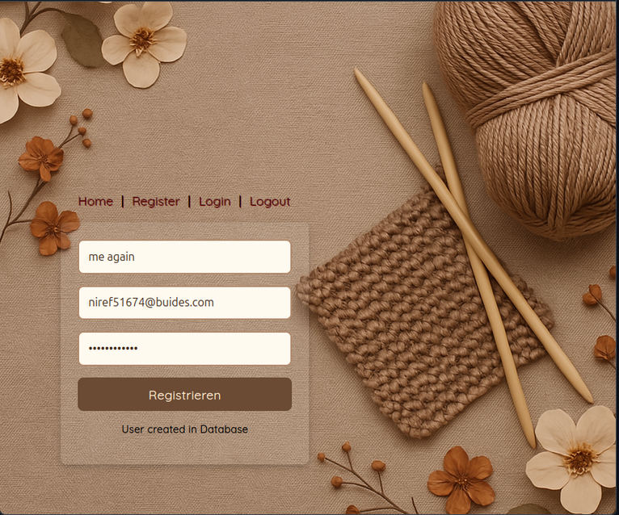

<a href="#top">↑ Back to top</a>

---

## 🧾 **./BackendCheatSheet**
- **GitHub:** [BackendCheatSheet](https://github.com/Marga-Lensen/BackendCheatSheet)  
- **Live:** [backend-cheat-sheet.vercel.app](https://backend-cheat-sheet.vercel.app)  
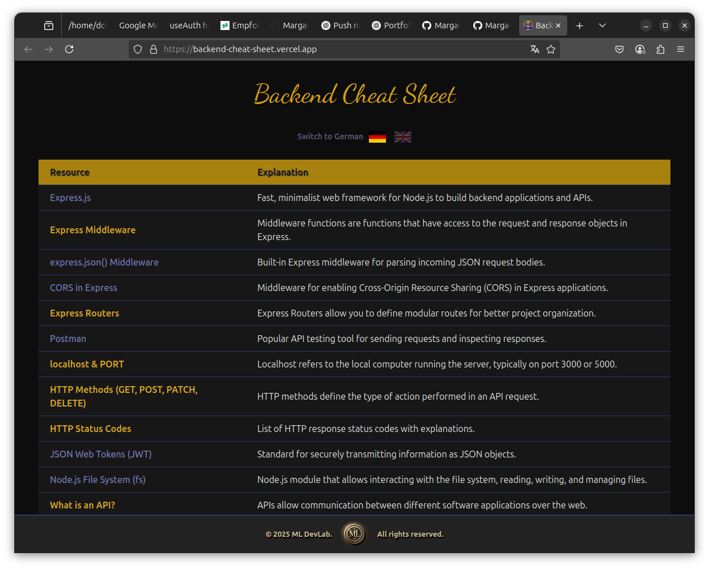

<a href="#top">↑ Back to top</a>

---

← <a href="./README.md">Back to main README</a>

<footer align="center" style="margin-top: 20px">
  <h4>Motto of a Digital Alchemist</h4>
  <h5 style="font-style: bold; color: goldenrod">Turning Code into Gold 🪄</h5>
  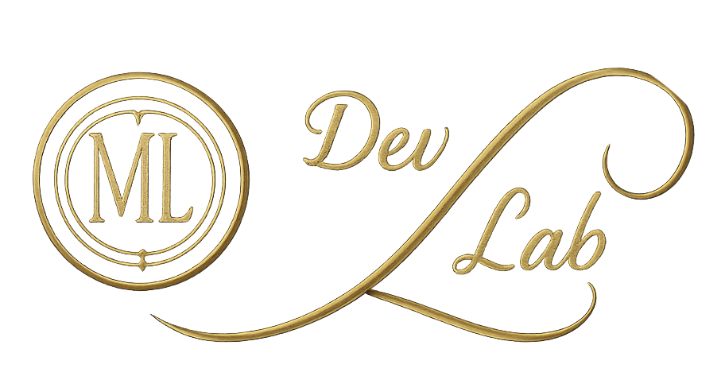
</footer>